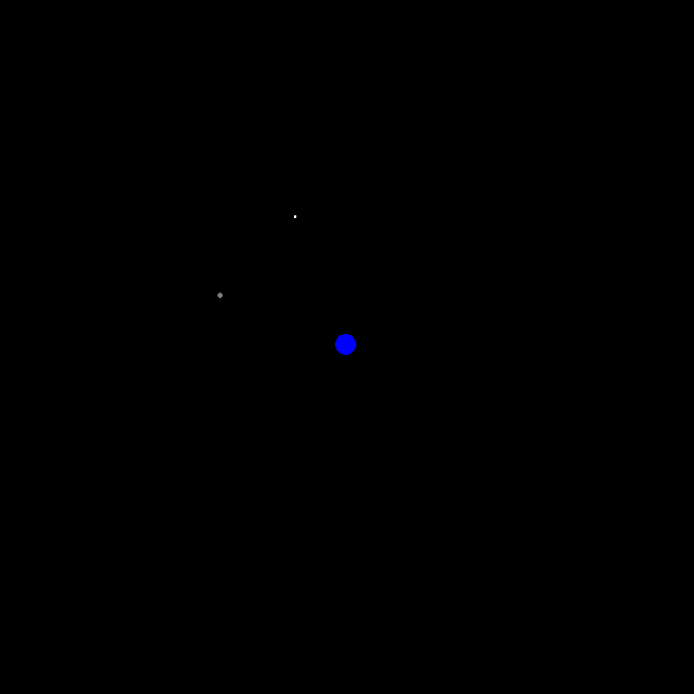

# Gravity Orbit Simulation

This simulation models the gravitational dynamics of an asteroid within the Earth-Moon system. The user is able to set the initial conditions for the asteroid, and the simulation calculates and visualizes the resulting trajectory. In cases where the asteroid's path leads to a collision with any of the celestial bodies, the simulation generates a visual representation of the resulting debris. Each set of initial parameters can lead to vastly different outcomes, highlighting the fascinating unpredictability inherent in orbital mechanics.

## Usage

Upon execution, the script prompts the user to input the initial parameters for the asteroid:
  - initial x-coordinate (default is 4e8 meters)
  - initial y-coordinate (default is 4e8 meters)
  - initial x-velocity (default is 300 m/s)
  - initial y-velocity (default is -300 m/s)

For optimal results, it's recommended to use position coordinates on the order of 108 and velocities in the low-to-mid hundreds. Higher values may cause the asteroid to venture beyond the visible area of the simulation. However, even if it's not visible, the asteroid will still remain gravitationally bound to the Earth.

## Behind the Scenes
The simulation utilizes `Body` and `Debris` classes to represent celestial objects and remnants of collisions, respectively. The positions and velocities of the Moon and the asteroid are updated based on gravitational influences using Newton's law of gravitation. Collisions are detected, resulting in the creation of debris particles for visual impact. It's noteworthy that the asteroid is influenced by both the Earth and the Moon, while the Moon's motion is influenced only by the Earth due to the asteroid's negligible mass.

After the initial parameters are set for the Earth, Moon, and asteroid, the `animation` function drives the simulation. This function continually updates the positions and velocities of the celestial bodies, as well as the positions and lifespans of any debris particles.

## Limitations

The system is [inherently chaotic](https://en.wikipedia.org/wiki/Three-body_problem), and small errors are bound to compound over time due to the discrete time step approach, leading to deviations from real-world trajectories.

Additionally, the debris generated during collisions is purely visual and does not account for the redistribution of mass or momentum during the collision, nor does it model gravitational interactions between individual debris particles.
